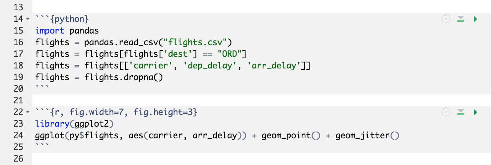
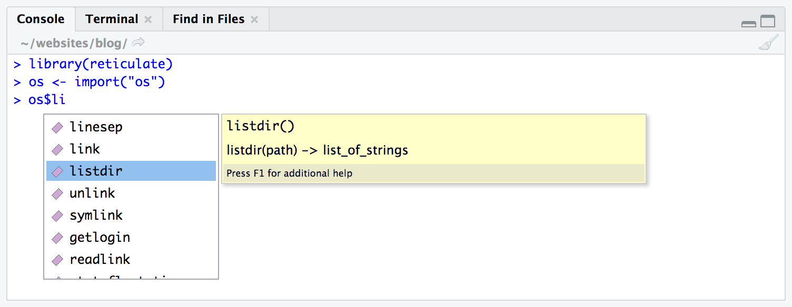
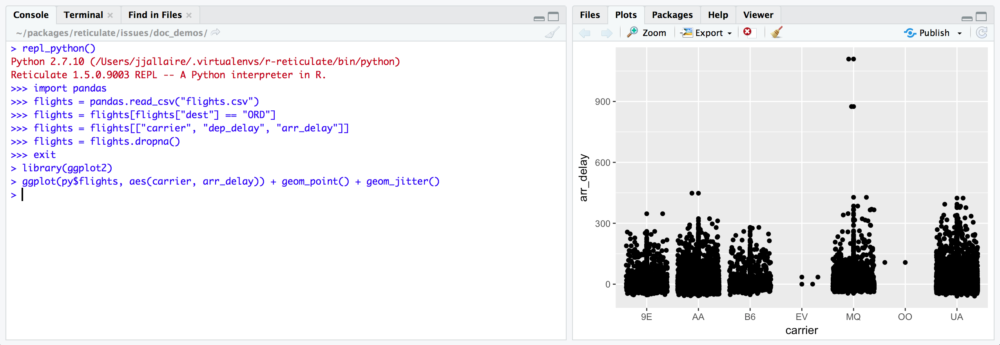

# R Interface to Python

<!-- badges: start -->

[](https://github.com/rstudio/reticulate/actions)

<!-- badges: end -->

The **reticulate** package provides a comprehensive set of tools for
interoperability between Python and R. The package includes facilities
for:


-   Calling Python from R in a variety of ways including R Markdown,
    sourcing Python scripts, importing Python modules, and using Python
    interactively within an R session.

-   Translation between R and Python objects (for example, between R and
    Pandas data frames, or between R matrices and NumPy arrays).

-   Flexible binding to different versions of Python including virtual
    environments and Conda environments.

Reticulate embeds a Python session within your R session, enabling
seamless, high-performance interoperability. If you are an R developer
that uses Python for some of your work or a member of data science team
that uses both languages, reticulate can dramatically streamline your
workflow!

### Getting started

#### Installation

Install the **reticulate** package from CRAN as follows:

``` r
install.packages("reticulate")
```

#### Python version

By default, reticulate uses an isolated python virtual environment named "r-reticulate".

The `use_python()` function enables you to specify an alternate python,
for example:

``` r
library(reticulate)
use_python("/usr/local/bin/python")
```

The `use_virtualenv()` and `use_condaenv()` functions enable you to
specify versions of Python in virtual or Conda environments, for
example:

``` r
library(reticulate)
use_virtualenv("myenv")
```

See the article on [Python Version
Configuration](https://rstudio.github.io/reticulate/articles/versions.html)
for additional details.

#### Python packages

You can install any required Python packages using standard shell tools
like `pip` and `conda`. Alternately, reticulate includes a set of
functions for managing and installing packages within virtualenvs and
Conda environments. See the article on [Installing Python
Packages](https://rstudio.github.io/reticulate/articles/python_packages.html)
for additional details.

#### Calling Python

There are a variety of ways to integrate Python code into your R
projects:

1.  [Python in R Markdown](#python-in-r-markdown) — A new Python
    language engine for R Markdown that supports bi-directional
    communication between R and Python (R chunks can access Python
    objects and vice-versa).

2.  [Importing Python modules](#importing-python-modules) — The
    `import()` function enables you to import any Python module and call
    it’s functions directly from R.

3.  [Sourcing Python scripts](#sourcing-python-scripts) — The
    `source_python()` function enables you to source a Python script the
    same way you would `source()` an R script (Python functions and
    objects defined within the script become directly available to the R
    session).

4.  [Python REPL](#python-repl) — The `repl_python()` function creates
    an interactive Python console within R. Objects you create within
    Python are available to your R session (and vice-versa).

Each of these techniques is explained in more detail below.

## Python in R Markdown

The **reticulate** package includes a Python engine for [R
Markdown](https://rmarkdown.rstudio.com/) with the following features:

1.  Run Python chunks in a single Python session embedded within your R
    session (shared variables/state between Python chunks)

2.  Printing of Python output, including graphical output from
    [matplotlib](https://matplotlib.org/).

3.  Access to objects created within Python chunks from R using the `py`
    object (e.g. `py$x` would access an `x` variable created within
    Python from R).

4.  Access to objects created within R chunks from Python using the `r`
    object (e.g. `r.x` would access to `x` variable created within R
    from Python)

Built in conversion for many Python object types is provided, including
[NumPy](https://numpy.org/) arrays and
[Pandas](https://pandas.pydata.org/) data frames. For example, you can
use Pandas to read and manipulate data then easily plot the Pandas data
frame using [ggplot2](https://ggplot2.tidyverse.org/):



Note that the reticulate Python engine is enabled by default within R
Markdown whenever reticulate is installed.

See the [R Markdown Python
Engine](https://rstudio.github.io/reticulate/articles/r_markdown.html)
documentation for additional details.

## Importing Python modules

You can use the `import()` function to import any Python module and call
it from R. For example, this code imports the Python `os` module and
calls the `listdir()` function:

``` r
library(reticulate)
os <- import("os")
os$listdir(".")
```

``` text
 [1] ".git"             ".gitignore"       ".Rbuildignore"    ".RData"
 [5] ".Rhistory"        ".Rproj.user"      ".travis.yml"      "appveyor.yml"
 [9] "DESCRIPTION"      "docs"             "external"         "index.html"
[13] "index.Rmd"        "inst"             "issues"           "LICENSE"
[17] "man"              "NAMESPACE"        "NEWS.md"          "pkgdown"
[21] "R"                "README.md"        "reticulate.Rproj" "src"
[25] "tests"            "vignettes"
```

Functions and other data within Python modules and classes can be
accessed via the `$` operator (analogous to the way you would interact
with an R list, environment, or reference class).

Imported Python modules support code completion and inline help:



See [Calling Python from
R](https://rstudio.github.io/reticulate/articles/calling_python.html)
for additional details on interacting with Python objects from within R.

## Sourcing Python scripts

You can source any Python script just as you would source an R script
using the `source_python()` function. For example, if you had the
following Python script *flights.py*:

``` python
import pandas
def read_flights(file):
  flights = pandas.read_csv(file)
  flights = flights[flights['dest'] == "ORD"]
  flights = flights[['carrier', 'dep_delay', 'arr_delay']]
  flights = flights.dropna()
  return flights
```

Then you can source the script and call the `read_flights()` function as
follows:

``` r
source_python("flights.py")
flights <- read_flights("flights.csv")

library(ggplot2)
ggplot(flights, aes(carrier, arr_delay)) + geom_point() + geom_jitter()
```

See the `source_python()` documentation for additional details on
sourcing Python code.

## Python REPL

If you want to work with Python interactively you can call the
`repl_python()` function, which provides a Python REPL embedded within
your R session. Objects created within the Python REPL can be accessed
from R using the `py` object exported from reticulate. For example:



Enter `exit` within the Python REPL to return to the R prompt.

Note that Python code can also access objects from within the R session
using the `r` object (e.g. `r.flights`). See the `repl_python()`
documentation for additional details on using the embedded Python REPL.

## Type conversions

When calling into Python, R data types are automatically converted to
their equivalent Python types. When values are returned from Python to R
they are converted back to R types. Types are converted as follows:

| R                      | Python            | Examples                                         |
|------------------------|-------------------|--------------------------------------------------|
| Single-element vector  | Scalar            | `1`, `1L`, `TRUE`, `"foo"`                       |
| Multi-element vector   | List              | `c(1.0, 2.0, 3.0)`, `c(1L, 2L, 3L)`              |
| List of multiple types | Tuple             | `list(1L, TRUE, "foo")`                          |
| Named list             | Dict              | `list(a = 1L, b = 2.0)`, `dict(x = x_data)`      |
| Matrix/Array           | NumPy ndarray     | `matrix(c(1,2,3,4), nrow = 2, ncol = 2)`         |
| Data Frame             | Pandas DataFrame  | `data.frame(x = c(1,2,3), y = c("a", "b", "c"))` |
| Function               | Python function   | `function(x) x + 1`                              |
| NULL, TRUE, FALSE      | None, True, False | `NULL`, `TRUE`, `FALSE`                          |

If a Python object of a custom class is returned then an R reference to
that object is returned. You can call methods and access properties of
the object just as if it was an instance of an R reference class.

## Learning more

The following articles cover the various aspects of using
**reticulate**:

-   [Calling Python from
    R](https://rstudio.github.io/reticulate/articles/calling_python.html)
    — Describes the various ways to access Python objects from R as well
    as functions available for more advanced interactions and conversion
    behavior.

-   [R Markdown Python
    Engine](https://rstudio.github.io/reticulate/articles/r_markdown.html)
    — Provides details on using Python chunks within R Markdown
    documents, including how call Python code from R chunks and
    vice-versa.

-   [Python Version
    Configuration](https://rstudio.github.io/reticulate/articles/versions.html)
    — Describes facilities for determining which version of Python is
    used by reticulate within an R session.

-   [Installing Python
    Packages](https://rstudio.github.io/reticulate/articles/python_packages.html)
    — Documentation on installing Python packages from PyPI or Conda,
    and managing package installations using virtualenvs and Conda
    environments.

-   [Using reticulate in an R
    Package](https://rstudio.github.io/reticulate/articles/package.html)
    — Guidelines and best practices for using reticulate in an R
    package.

-   [Arrays in R and
    Python](https://rstudio.github.io/reticulate/articles/arrays.html) —
    Advanced discussion of the differences between arrays in R and
    Python and the implications for conversion and interoperability.

-   [Python
    Primer](https://rstudio.github.io/reticulate/articles/python_primer.html)
    — Introduction to Python for R users.

## Why reticulate?

From the [Wikipedia](https://en.wikipedia.org/wiki/Reticulated_python)
article on the reticulated python:

> The reticulated python is a species of python found in Southeast Asia.
> They are the world’s longest snakes and longest reptiles…The specific
> name, reticulatus, is Latin meaning “net-like”, or reticulated, and is
> a reference to the complex colour pattern.

From the
[Merriam-Webster](https://www.merriam-webster.com/dictionary/reticulate)
definition of reticulate:

> 1: resembling a net or network; especially : having veins, fibers, or
> lines crossing a reticulate leaf. 2: being or involving evolutionary
> change dependent on genetic recombination involving diverse
> interbreeding populations.

The package enables you to *reticulate* Python code into R, creating a
new breed of project that weaves together the two languages.
