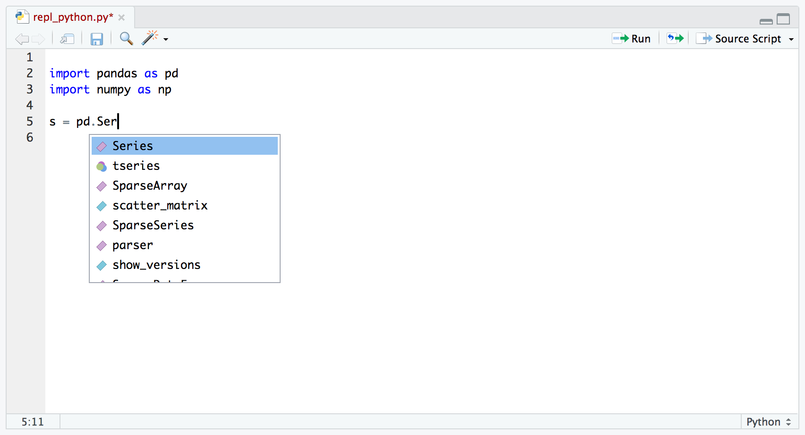
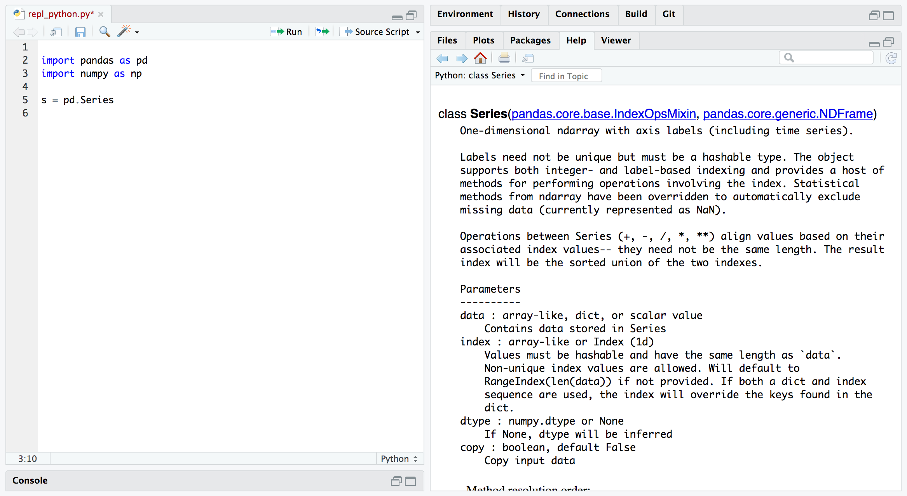

# RStudio IDE Tools for reticulate

## Overview

[RStudio v1.2](https://rstudio.com/products/rstudio/download/) brings
support for the reticulate package, including:

1.  Support for executing reticulated Python chunks within [R
    Notebooks](https://rmarkdown.rstudio.com/r_notebooks.html).

2.  Line-by-line execution of Python code using the reticulate
    [`repl_python()`](https://rstudio.github.io/reticulate/reference/repl_python.md)
    function.

3.  Sourcing Python scripts using the reticulate
    [`source_python()`](https://rstudio.github.io/reticulate/reference/source_python.md)
    function.

4.  Code completion and inline help for Python.

5.  Display of [matplotlib](https://matplotlib.org/) plots within both
    notebook and console execution modes.

A note about the philosophy behind Python tools within RStudio: these
tools are not intended for standalone Python work but rather explicitly
aimed at the *integration of Python into R projects* (and as such are
closely tied to the reticulate package).

There are many IDEs available for doing data science with Python
including [JupyterLab](https://github.com/jupyterlab/jupyterlab),
[Rodeo](https://www.yhat.com/products/rodeo),
[Spyder](https://github.com/spyder-ide/spyder), and [Visual Studio
Code](https://code.visualstudio.com/docs/languages/python), and we
strongly recommend using one of them for Python-only projects. However,
if you are using reticulated Python within an R project then RStudio
provides a set of tools that we think you will find extremely helpful.

## Installation

You can download the latest RStudio release here:
<https://rstudio.com/products/rstudio/download/>.

All of the features described below require that you have previously
installed the reticulate package, which you can do as follows:

``` r
install.packages("reticulate")
```

## R Notebooks

R Notebooks have been enhanced to support executing Python chunks using
the reticulate Python engine. For example:


### matplotlib

R Notebooks can also display matplotlib plots inline when they are
printed from Python chunks:


## Line-by-Line Execution

You can execute code from Python scripts line-by-line using the **Run**
button (or Control+Enter) in the same way as you execute R code
line-by-line. RStudio will automatically switch into reticulate’s
[`repl_python()`](https://rstudio.github.io/reticulate/reference/repl_python.md)
mode whenever you execute lines from a Python script:


Type `exit` from the Python REPL to exit back into R (RStudio will also
automatically switch back to R mode whenever you execute code from an R
script).

## Sourcing Scripts

Click the editor’s **Source Script** button within a Python source file
to execute a script using reticulate’s
[`source_python()`](https://rstudio.github.io/reticulate/reference/source_python.md)
function:


## Completion and Help

RStudio now provides code completion for Python scripts:



Additionally, pressing the F1 button over a Python symbol will display
the help topic for that symbol:


