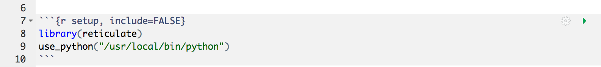
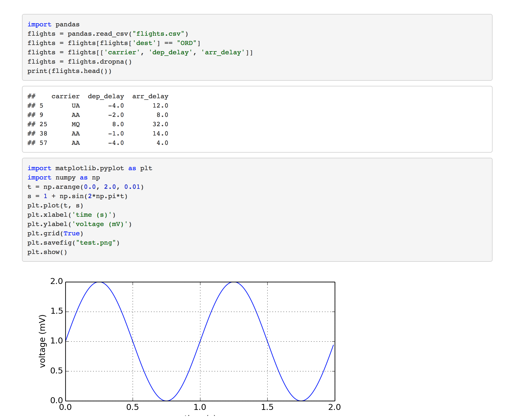
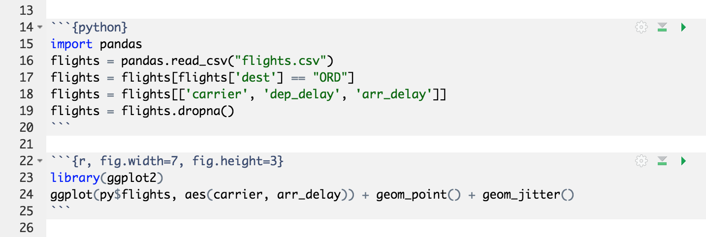
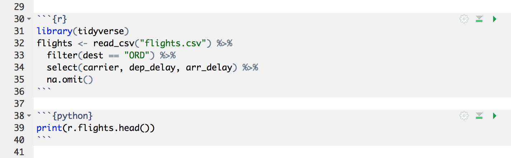
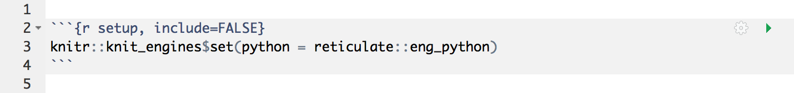
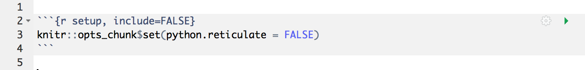

```{r setup, include=FALSE}
knitr::opts_chunk$set(eval = FALSE)
```


## Overview

The **reticulate** package includes a Python engine for [R Markdown](http://rmarkdown.rstudio.com) that enables easy interoperabilty between Python and R chunks. 

Python chunks behave very similar to R chunks (including graphical output from matplotlib) and the two languages have full access each other's objects. Built in conversion for many Python object types is provided, including [NumPy](http://www.numpy.org/) arrays and [Pandas](https://pandas.pydata.org/) data frames. 

If you are using knitr version 1.18 or higher, then the reticulate Python engine will be enabled by default whenever reticulate is installed and no further setup is required. If you are running an earlier version of knitr or want to disable the use of the reticulate engine see the [Engine Setup] section below.

## Python Version

By default, reticulate uses the version of Python found on your `PATH` (i.e. `Sys.which("python")`). If you want to use an alternate version you should add one of the `use_python()` family of functions to your R Markdown setup chunk, for example:

{.screenshot width="98%"}

See the article on [Python Version Configuration](versions.html) for additional details on configuring Python versions (including the use of conda or virtualenv environments).

## Python Chunks

Python code chunks work exactly like R code chunks: Python code is executed and any print or graphical (matplotlib) output is included within the document. 

Python chunks all execute within a single Python session so have access to all objects created in previous chunks. Chunk options like `echo`, `include`, etc. all work as expected.

Here's an R Markdown document that demonstrates this:

{.screenshot width="98%"}

Note that the [RStudio v1.2 preview release](https://www.rstudio.com/rstudio/download/preview/) includes support for using reticulate to execute Python chunks within R Notebooks. See the [RStudio IDE Tools for reticulate](https://rstudio.github.io/reticulate/articles/rstudio_ide.html) article for additional details.

## Calling Python from R

All objects created within Python chunks are available to R using the `py` object exported by the reticulate package. For example, the following code demonstrates reading and filtering a CSV file using Pandas then plotting the resulting data frame using ggplot2:

{.screenshot width="98%"}

See the [Calling Python from R](calling_python.html) article for additional details on how to interact with Python types from within R

## Calling R from Python

You can analagously access R objects within Python chunks via the `r` object. For example:

{.screenshot width="98%"}

## Engine Setup

If you are using a version of knitr prior to 1.18 then add this code to your setup chunk to enable the reticulate Python engine:

{.screenshot width="98%"}

If you do not wish to use the reticulate Python engine then set the `python.reticulate` chunk option to `FALSE`:

{.screenshot width="98%"}

