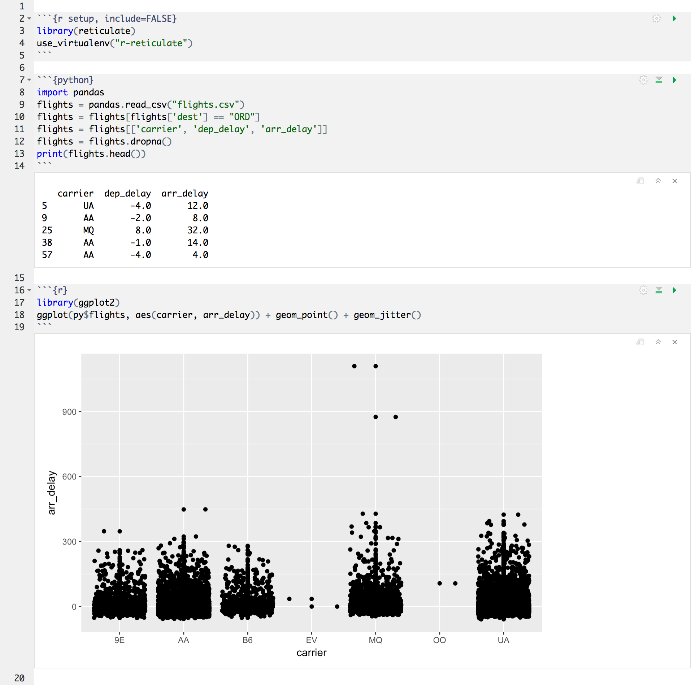
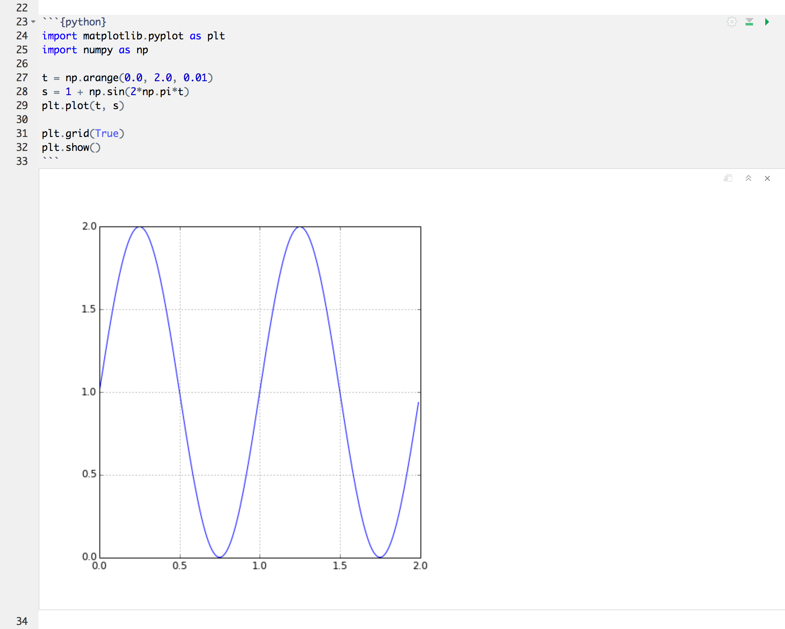
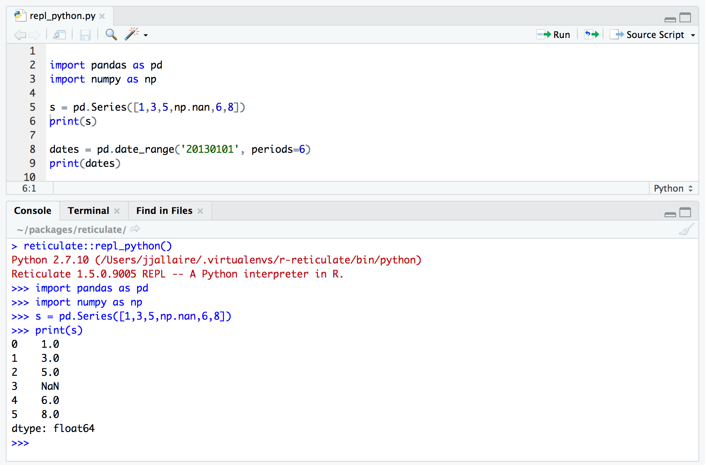
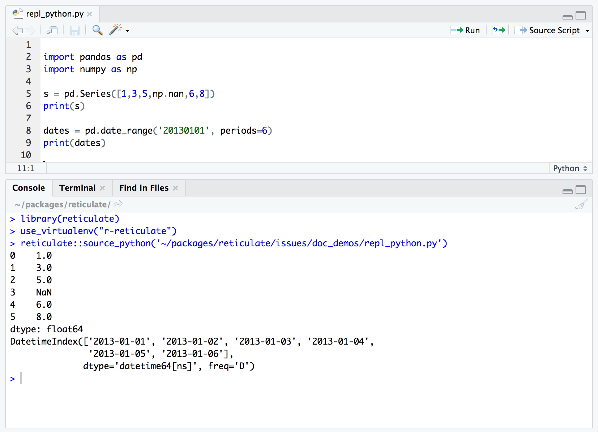
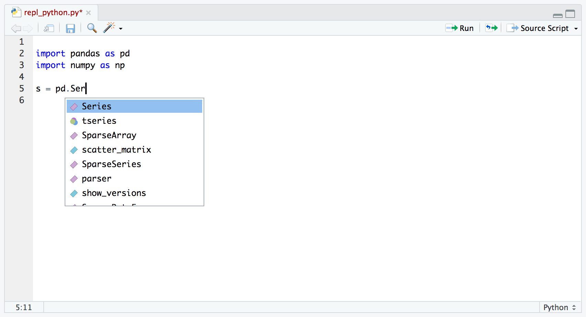
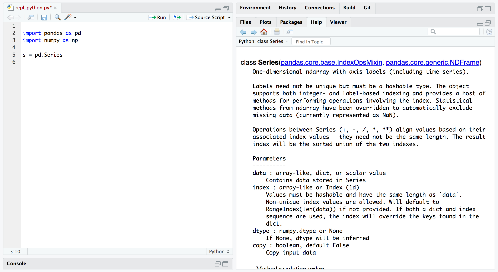

```{r setup, include=FALSE}
knitr::opts_chunk$set(eval = FALSE)
```

<link rel="stylesheet" type="text/css" href="extra.css"/>

## Overview

The current [daily builds](https://dailies.rstudio.com) of RStudio IDE include experimental support for the reticulate package, including:

1) Support for executing reticulated Python chunks within [R Notebooks](https://rmarkdown.rstudio.com/r_notebooks.html).

2) Line-by-line execution of Python code using the reticulate `repl_python()` function.

3) Sourcing Python scripts using the reticulate `source_python()` function.

4) Code completion and inline help for Python. 

5) Display of [matplotlib](https://matplotlib.org/) plots within both notebook and console execution modes.

A note about the philosophy behind Python tools within RStudio: these tools are not intended for standalone Python work but rather explicitly aimed at the *integration of Python into R projects* (and as such are closely tied to the reticulate package). 

There are many IDEs available for doing data science with Python including [JupyterLab](https://github.com/jupyterlab/jupyterlab), [Rodeo](https://www.yhat.com/products/rodeo), [Spyder](https://github.com/spyder-ide/spyder), and [Visual Studio Code](https://code.visualstudio.com/docs/languages/python), and we strongly recommend using one of them for Python-only projects. However, if you are using reticulated Python within an R project then RStudio provides a set of tools that we think you will find extremely helpful.

## Installation

You can download the current daily build of RStudio for various platforms here: 

- [Windows Desktop](https://dailies.rstudio.com/rstudio/oss/windows/)

- [Mac OS X Desktop](https://dailies.rstudio.com/rstudio/oss/mac/)

- [Ubuntu Desktop](https://dailies.rstudio.com/rstudio/oss/ubuntu/amd64/)

- [RedHat Server](https://dailies.rstudio.com/rstudioserver/oss/redhat6/x86_64/)

- [Ubuntu Server](https://dailies.rstudio.com/rstudioserver/oss/ubuntu/amd64/)

- [Other Platforms](https://dailies.rstudio.com)

<div class="alert alert-warning">
Note that RStudio daily builds are intended for testing purposes, and are not recommended for general use. If you use the daily build to try out the new features please report bugs at <https://github.com/rstudio/rstudio/issues>.
</div>

Al of the features described below require that you have previously installed the reticulate package, which you can do as follows:

```r
install.packages("reticulate")
```

## R Notebooks

R Notebooks have been enhanced to support executing Python chunks using the reticulate Python engine. For example:

{.screenshot width="98%"}

### matplotlib

R Notebooks can also display matplotlib plots inline when they are printed from Python chunks:

{.screenshot width="98%"}


## Line-by-Line Execution

You can execute code from Python scripts line-by-line using the **Run** button (or Control+Enter) in the same way as you execute R code line-by-line. RStudio will automatically switch into reticulate's `repl_python()` mode whenever you execute lines from a Python script:

{.screenshot width="98%"}

Type `exit` from the Python REPL to exit back into R (RStudio will also automatically switch back to R mode whenever you execute code from an R script).

## Sourcing Scripts

Click the editor's **Source Script** button within a Python source file to execute a script using reticulate's `source_python()` function:

{.screenshot width="98%"}


## Completion and Help

RStudio now provides code completion for Python scripts:

{.screenshot width="98%"}


Additionally, pressing the F1 button over a Python symbol will display the help topic for that symbol:

{.screenshot width="98%"}


